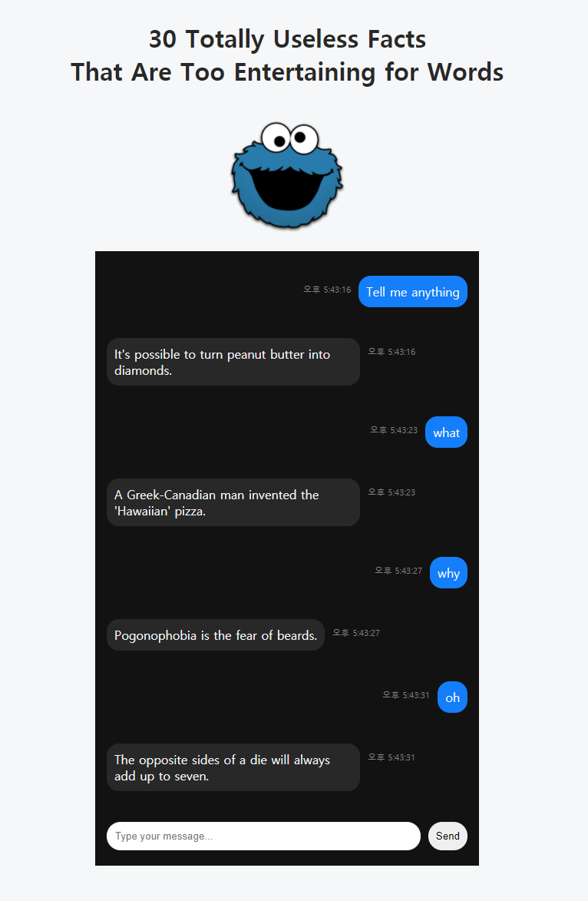

# JSChat
a simple chat application using HTML, CSS, JavaScript and jQuery.

## Try it !
You can try this application here: https://codepen.io/jihyo-jeon/pen/KKmVeyp

  

## References
Learnt how to set the files from: https://codepen.io/oieusouamiguel/pen/vbRrLm \
Got the contents from: https://bestlifeonline.com/useless-facts/ \
Cookiemonster.png from: https://favpng.com/png_view/cookie-monster-cookie-monster-elmo-drawing-clip-art-png/BSB2vxN3
